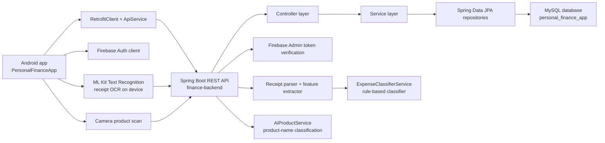
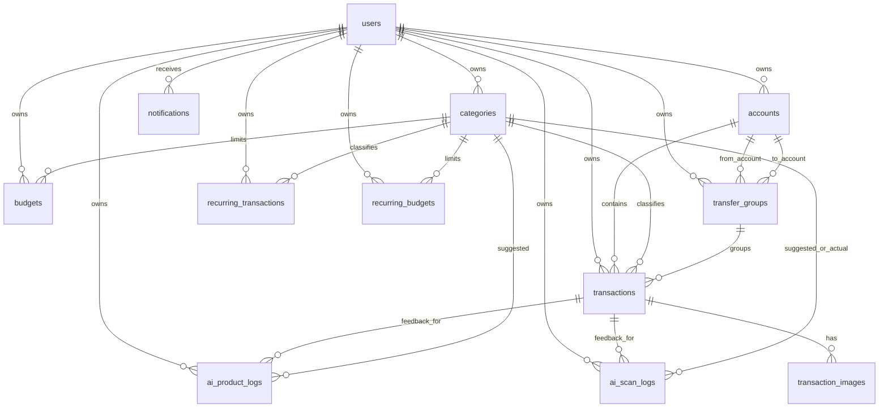
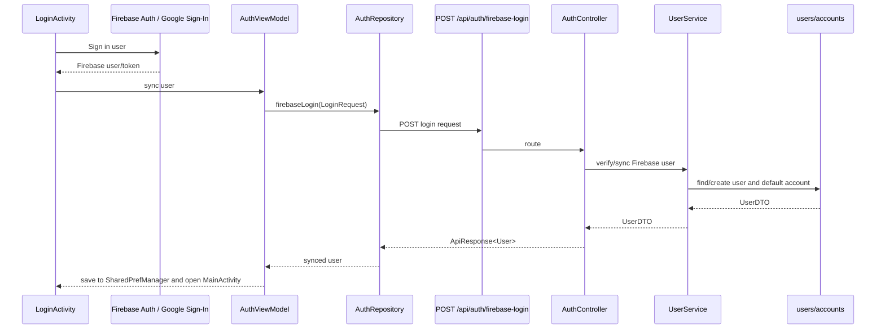
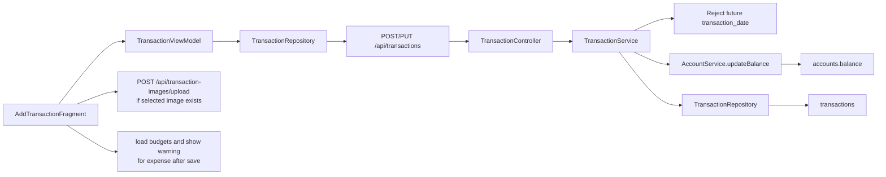
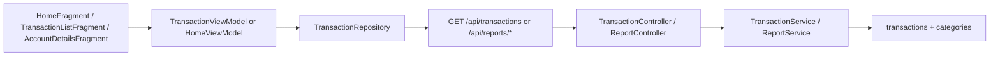
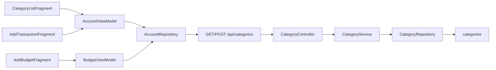
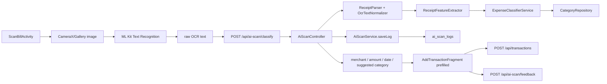
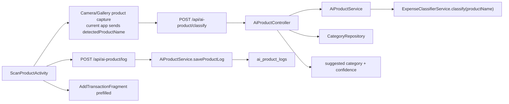
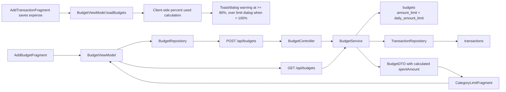
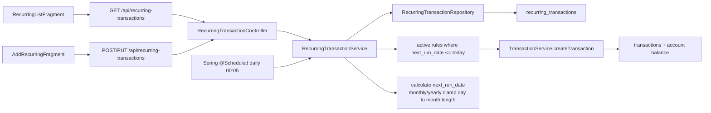

# PROJECT_GRAPH

Updated: 2026-05-31

This document maps the current project without changing runtime code. Read this file before editing flows, screens, API contracts, database schema, or AI/OCR behavior.

## 1. High Level Architecture

## 2. Android App Mapping

Root: `PersonalFinanceApp/app/src/main/java/com/example/personalfinance`

### App Entry And Navigation

| File | Type | Function | Calls | Called by |
| --- | --- | --- | --- | --- |
| `activities/SplashActivity.java` | Activity | Launcher. Loads saved server IP, checks saved user, routes to `MainActivity` or `LoginActivity`. | `RetrofitClient.updateBaseUrl`, `SharedPrefManager` | Android launcher |
| `activities/LoginActivity.java` | Activity | Login with email/password or Google/Firebase, lets user edit backend IP. | `AuthViewModel`, `FirebaseAuthHelper`, `RetrofitClient.updateBaseUrl`, `SharedPrefManager` | `SplashActivity`, logout from `ProfileFragment` |
| `activities/RegisterActivity.java` | Activity | Registration screen. | Firebase auth helper/classes | `LoginActivity` |
| `activities/MainActivity.java` | Activity | Hosts bottom navigation and main fragments. Default is `HomeFragment`. Scan/add button opens manual/OCR/YOLO choices. | `HomeFragment`, `TransactionListFragment`, `CategoryLimitFragment`, `TransactionFragment`, `AddTransactionFragment`, `ScanBillActivity` | `SplashActivity`, `LoginActivity` |

### Main Screens / Fragments

| File | Type | Function | Calls | Called by |
| --- | --- | --- | --- | --- |
| `fragments/home/HomeFragment.java` | Fragment | Home dashboard: monthly/daily metrics, recent transactions, accounts, budgets, quick add/scan actions. | `HomeViewModel`, `AccountViewModel`, `BudgetViewModel`, `AddTransactionFragment`, `AddAccountFragment`, `ScanBillActivity`, `ScanProductActivity` | `MainActivity` home tab |
| `fragments/transaction/TransactionListFragment.java` | Fragment | Transaction list/history, month navigation, add/edit transaction, routes to recurring list and scan screens. | `TransactionViewModel`, `TransactionAdapter`, `AddTransactionFragment`, `RecurringListFragment`, `ScanBillActivity`, `ScanProductActivity` | `MainActivity` transactions tab |
| `fragments/transaction/TransactionFragment.java` | Fragment | Statistics screen. Category-only chart/list, period tabs `month/year/all`, type tabs `expense/income`, default `month + expense`. | `TransactionRepository.getCategoryReport`, `CategoryStatsAdapter`, MPAndroidChart | `MainActivity` statistics tab |
| `fragments/category/CategoryLimitFragment.java` | Fragment | Budget/limit overview per category with month/year/all display. Category detail click is currently removed. | `BudgetViewModel`, internal `LimitAdapter` | `MainActivity` budget tab |
| `fragments/profile/ProfileFragment.java` | Fragment | Profile/settings style screen, metrics, links to category/budget settings, logout. | `HomeViewModel`, `CategoryListFragment`, `BudgetFragment`, Firebase logout | `MainActivity` profile navigation from home/profile UI |
| `fragments/account/AccountFragment.java` | Fragment | Wallet/account list and add account. | `AccountViewModel`, `AccountAdapter`, `AddAccountFragment`, `AccountDetailsFragment` | Home/account navigation |
| `fragments/account/AccountDetailsFragment.java` | Fragment | Shows transactions filtered client-side by account. | `TransactionViewModel.loadTransactions` | `AccountFragment` |
| `fragments/category/CategoryListFragment.java` | Fragment | Category list and add category dialog. | `AccountViewModel.loadCategories/createCategory`, internal `CategoryAdapter` | `ProfileFragment` |
| `fragments/budget/BudgetFragment.java` | Fragment | Budget management list and add budget bottom sheet. | `BudgetViewModel`, `BudgetAdapter`, `AddBudgetFragment` | `ProfileFragment` |

### Dialogs / Bottom Sheets / Detail Screens

| File | Type | Function | Calls | Called by |
| --- | --- | --- | --- | --- |
| `fragments/transaction/AddTransactionFragment.java` | DialogFragment | Create/edit manual transaction. Blocks future transaction dates, supports receipt image upload after transaction creation, checks local budget warning after expense save. | `TransactionViewModel`, `BudgetViewModel`, `RetrofitClient.uploadTransactionImage`, `ApiService.submitScanFeedback` when OCR log exists | `MainActivity`, `HomeFragment`, `TransactionListFragment`, `ScanBillActivity`, `ScanProductActivity` |
| `fragments/transaction/AddRecurringFragment.java` | BottomSheetDialogFragment | Create/edit recurring transaction. Loads categories, posts/puts recurring transaction. | `ApiService.getCategories`, `createRecurringTransaction`, `updateRecurringTransaction` | `RecurringListFragment` |
| `fragments/recurring/RecurringListFragment.java` | Fragment | Lists recurring transactions, toggles active state, edits/deletes recurring rules. | `ApiService.getRecurringTransactions`, `updateRecurringTransaction`, `deleteRecurringTransaction`, `AddRecurringFragment` | `TransactionListFragment` recurring button |
| `fragments/budget/AddBudgetFragment.java` | BottomSheetDialogFragment | Add monthly budgets per category, including optional daily max limit. | `BudgetViewModel.loadCategories/createBudget(s)` | `BudgetFragment` |
| `fragments/account/AddAccountFragment.java` | BottomSheetDialogFragment | Create account/wallet. | `AccountViewModel.createAccount` | `HomeFragment`, `AccountFragment` |
| `fragments/transaction/DayTransactionsBottomSheet.java` | BottomSheetDialogFragment | Shows transactions for one calendar day. | Internal adapter | Calendar/day UI |
| `fragments/transaction/DayDetailFragment.java` | Fragment | Day-level transaction detail/list. | `TransactionViewModel` | Calendar/day navigation |
| `fragments/category/CategoryLimitDetailsActivity.java` | Activity | Old category limit detail/edit screen. Current list click entry was removed, but activity is still declared. | `ApiService.updateBudget` | Static `start()` helper; no active list entry after recent change |

### Scan Activities

| File | Type | Function | Calls | Called by |
| --- | --- | --- | --- | --- |
| `activities/ScanBillActivity.java` | Activity | Camera/gallery receipt scan. Uses ML Kit text recognizer on device, sends raw OCR text to backend classification, then opens `AddTransactionFragment` with detected amount/date/category/merchant. | ML Kit Text Recognition, `ApiService.classifyBill` | `HomeFragment`, `TransactionListFragment`, add bottom sheet |
| `activities/ScanProductActivity.java` | Activity | Camera/gallery product scan. Current detected product name is sent to backend classifier, then log is saved and add-transaction dialog opens. | `ApiService.classifyProduct`, `ApiService.saveProductLog`, `AddTransactionFragment` | `HomeFragment`, `TransactionListFragment` |

### Android Data Layer

| File | Type | Function | Calls | Called by |
| --- | --- | --- | --- | --- |
| `api/ApiService.java` | Retrofit interface | Defines every backend endpoint consumed by Android. | Backend REST endpoints | Repositories and some activities/fragments directly |
| `api/RetrofitClient.java` | API client | Builds Retrofit client and supports changing base URL from saved IP. | `ApiService` | App-wide |
| `repositories/AuthRepository.java` | Repository | Firebase login sync. | `POST /api/auth/firebase-login` | `AuthViewModel` |
| `repositories/TransactionRepository.java` | Repository | CRUD transactions, transfer, reports, AI scan/product helper calls. | `/api/transactions`, `/api/transfers`, `/api/reports/*`, `/api/ai-*` | `TransactionViewModel`, `HomeViewModel`, `TransactionFragment` |
| `repositories/AccountRepository.java` | Repository | Account CRUD and category get/create. | `/api/accounts`, `/api/categories` | `AccountViewModel` |
| `repositories/BudgetRepository.java` | Repository | Budget CRUD. | `/api/budgets` | `BudgetViewModel` |
| `viewmodels/AuthViewModel.java` | ViewModel | Exposes login/sync state. | `AuthRepository` | `LoginActivity` |
| `viewmodels/HomeViewModel.java` | ViewModel | Exposes monthly/daily reports and transactions. | `TransactionRepository` | `HomeFragment`, `ProfileFragment` |
| `viewmodels/TransactionViewModel.java` | ViewModel | Exposes transaction/account/category data and create/update/delete actions. | `TransactionRepository`, `AccountRepository` | Transaction screens and add/edit dialogs |
| `viewmodels/AccountViewModel.java` | ViewModel | Exposes account/category state. | `AccountRepository` | Account and category screens |
| `viewmodels/BudgetViewModel.java` | ViewModel | Exposes budget/category state and bulk budget creation. | `BudgetRepository`, `AccountRepository` | Budget/limit screens |

### Android Adapters

| File | Function | Used by |
| --- | --- | --- |
| `adapters/TransactionAdapter.java` | Grouped transaction rows and date headers. | `TransactionListFragment`, account/day related lists |
| `adapters/CategoryStatsAdapter.java` | Category statistics rows with amount, percent, progress color. | `TransactionFragment` |
| `adapters/BudgetAdapter.java` | Budget list rows. | `BudgetFragment` |
| `adapters/AccountAdapter.java` | Account/wallet rows. | `AccountFragment` |
| `adapters/HorizontalAccountAdapter.java` | Horizontal account cards. | `HomeFragment` |
| `adapters/CalendarGridAdapter.java` | Calendar grid days. | Calendar/day UI |
| `adapters/DayTransactionsAdapter.java` | Day transaction rows. | Day transaction UI |
| `fragments/category/CategoryLimitFragment.java` internal `LimitAdapter` | Category limit rows. | `CategoryLimitFragment` |
| `fragments/category/CategoryListFragment.java` internal `CategoryAdapter` | Category settings rows. | `CategoryListFragment` |
| `fragments/recurring/RecurringListFragment.java` internal `RecurringAdapter` | Recurring transaction rows. | `RecurringListFragment` |

## 3. Backend Mapping

Root: `finance-backend/src/main/java/com/example/financebackend`

### Controllers To Services

| Controller | Endpoints | Calls | Main caller screens |
| --- | --- | --- | --- |
| `controller/AuthController.java` | `POST /api/auth/firebase-login` | `UserService.syncFirebaseUserWithToken` or fallback sync | `LoginActivity` |
| `controller/UserController.java` | `GET /api/users/{id}`, `PUT /api/users/{id}` | `UserService` | User/profile related API; limited current direct use |
| `controller/AccountController.java` | `GET/POST /api/accounts`, `PUT/DELETE /api/accounts/{id}` | `AccountService` | `HomeFragment`, `AccountFragment`, `AddAccountFragment` |
| `controller/CategoryController.java` | `GET/POST /api/categories`, `PUT/DELETE /api/categories/{id}` | `CategoryService` | `CategoryListFragment`, `AddTransactionFragment`, `AddBudgetFragment`, `AddRecurringFragment` |
| `controller/TransactionController.java` | `GET/POST /api/transactions`, `GET/PUT/DELETE /api/transactions/{id}` | `TransactionService` | Home, transaction list, account details, add/edit transaction |
| `controller/TransferController.java` | `POST /api/transfers` | `TransferService` | Repository method exists; UI is not fully active |
| `controller/BudgetController.java` | `GET/POST /api/budgets`, `GET/PUT/DELETE /api/budgets/{id}` | `BudgetService` | Budget screens, limit overview, warning check data |
| `controller/ReportController.java` | `GET /api/reports/daily`, `/monthly`, `/by-category` | `ReportService` | Home/profile metrics and statistics screen |
| `controller/NotificationController.java` | `GET /api/notifications`, `PUT /api/notifications/{id}/read` | `NotificationService` | API exists; no strong active Android screen found |
| `controller/AiScanController.java` | `POST /api/ai-scan/classify`, `/feedback` | `ReceiptParser`, `ReceiptFeatureExtractor`, `ExpenseClassifierService`, `AiScanService`, `CategoryRepository` | `ScanBillActivity`, `AddTransactionFragment` feedback after save |
| `controller/AiProductController.java` | `POST /api/ai-product/classify`, `/log` | `AiProductService`, `CategoryRepository` | `ScanProductActivity` |
| `controller/AdminMlController.java` | `POST /api/admin/ml/retrain` | `ExpenseClassifierService.retrain` | Admin/dev endpoint only |
| `controller/RecurringTransactionController.java` | `GET/POST /api/recurring-transactions`, `PUT/DELETE /api/recurring-transactions/{id}`, `POST /trigger` | `RecurringTransactionService` | `RecurringListFragment`, `AddRecurringFragment`; trigger endpoint can be manual/admin |
| `controller/TransactionImageController.java` | `POST /api/transaction-images/upload` | `TransactionImageRepository`, `TransactionRepository`, file storage | `AddTransactionFragment` after transaction save |

### Services

| Service | Function | Calls | Called by |
| --- | --- | --- | --- |
| `service/UserService.java` | Sync Firebase user, create default account on first sync, update/get users. | `UserRepository`, `AccountService` | `AuthController`, `UserController` |
| `service/AccountService.java` | Account CRUD and balance updates. Provides default account helper. | `AccountRepository`, `UserRepository` | `AccountController`, `TransactionService`, `TransferService`, `UserService` |
| `service/CategoryService.java` | Category CRUD, returns user categories plus default categories. | `CategoryRepository`, `UserRepository` | `CategoryController` |
| `service/TransactionService.java` | Transaction CRUD, date-range query, balance adjustment, future-date validation. | `TransactionRepository`, `UserRepository`, `AccountRepository`, `CategoryRepository`, `AccountService` | `TransactionController`, `RecurringTransactionService` |
| `service/TransferService.java` | Creates transfer group and paired transfer transactions. | `TransferGroupRepository`, `UserRepository`, `AccountRepository`, `TransactionRepository`, `AccountService` | `TransferController` |
| `service/BudgetService.java` | Budget CRUD, active budgets, calculate spent from transactions, exceeded check. Supports `dailyAmountLimit`. | `BudgetRepository`, `UserRepository`, `CategoryRepository`, `TransactionRepository` | `BudgetController` |
| `service/ReportService.java` | Daily/monthly/category summaries from transactions. | `TransactionRepository` | `ReportController` |
| `service/NotificationService.java` | Notification list/create/mark read. | `NotificationRepository`, `UserRepository` | `NotificationController`; not integrated into budget warning UI |
| `service/AiScanService.java` | Save OCR classification logs and correction feedback. | `AiScanLogRepository`, `UserRepository`, `CategoryRepository`, `TransactionRepository` | `AiScanController` |
| `service/AiProductService.java` | Save product scan logs and classify product name through expense classifier. | `AiProductLogRepository`, `UserRepository`, `CategoryRepository`, `ExpenseClassifierService` | `AiProductController` |
| `service/ExpenseClassifierService.java` | Rule-based keyword/category classifier for receipt features and product names. `retrain()` is placeholder. | In-memory keyword map | `AiScanController`, `AiProductService`, `AdminMlController` |
| `service/RecurringTransactionService.java` | Recurring transaction CRUD and scheduled generation. Runs daily at 00:05. Monthly/yearly date uses original start day but clamps to month length. | `RecurringTransactionRepository`, `UserRepository`, `AccountRepository`, `CategoryRepository`, `TransactionService` | `RecurringTransactionController`, Spring scheduler |
| `service/ocr/OcrTextNormalizer.java` | Normalize OCR text. | None | `ReceiptParser` |
| `service/ocr/ReceiptParser.java` | Extract merchant, amount, date/hour from raw OCR text. | `OcrTextNormalizer` | `AiScanController` |
| `service/ocr/ReceiptFeatureExtractor.java` | Convert parsed receipt into feature vector/signals. | `ReceiptData` | `AiScanController` |

### Repositories

| Repository | Entity | Important methods |
| --- | --- | --- |
| `repository/UserRepository.java` | `User` | `findByFirebaseUid`, `findByEmail` |
| `repository/AccountRepository.java` | `Account` | `findByUserUserId` |
| `repository/CategoryRepository.java` | `Category` | `findByUserUserIdOrIsDefaultTrue` |
| `repository/TransactionRepository.java` | `Transaction` | `findByUserUserId`, `findByUserUserIdAndTransactionDateBetween` |
| `repository/TransferGroupRepository.java` | `TransferGroup` | `findByUserUserId` |
| `repository/BudgetRepository.java` | `Budget` | `findByUserUserId`, active-by-date query |
| `repository/TransactionImageRepository.java` | `TransactionImage` | `findByTransactionTransactionId` |
| `repository/AiScanLogRepository.java` | `AiScanLog` | `findByUserUserId` |
| `repository/AiProductLogRepository.java` | `AiProductLog` | `findByUserUserId` |
| `repository/NotificationRepository.java` | `Notification` | `findByUserUserId`, unread query |
| `repository/RecurringTransactionRepository.java` | `RecurringTransaction` | `findByUserUserId`, `findByIsActiveTrueAndNextRunDateLessThanEqual` |

### Entities And DTOs

| Entity | Table | DTO/model role |
| --- | --- | --- |
| `model/User.java` | `users` | `dto/UserDTO.java`, Android `models/User.java` |
| `model/Account.java` | `accounts` | `dto/AccountDTO.java`, Android `models/Account.java` |
| `model/Category.java` | `categories` | `dto/CategoryDTO.java`, Android `models/Category.java` |
| `model/Transaction.java` | `transactions` | `dto/TransactionDTO.java`, Android `models/Transaction.java` |
| `model/TransferGroup.java` | `transfer_groups` | Android `models/TransferRequest.java` for request |
| `model/Budget.java` | `budgets` | `dto/BudgetDTO.java`, Android `models/Budget.java` |
| `model/TransactionImage.java` | `transaction_images` | Upload response uses `ApiResponse<Void>` |
| `model/AiScanLog.java` | `ai_scan_logs` | Android `AiScanResult`, `ScanFeedbackRequest` |
| `model/AiProductLog.java` | `ai_product_logs` | Android `AiProductClassificationResult`, `AiProductLog`, product request models |
| `model/Notification.java` | `notifications` | Android `models/Notification.java` |
| `model/RecurringTransaction.java` | `recurring_transactions` | `dto/RecurringTransactionDTO.java`, Android `models/RecurringTransaction.java` |

Shared response wrapper: backend `dto/ApiResponse.java`, Android `models/ApiResponse.java`.

## 4. Database Graph

Schema file: `database/schema.sql`

### Main Tables

| Table | PK | Important FKs | Purpose |
| --- | --- | --- | --- |
| `users` | `user_id` | none | App user synced from Firebase. |
| `accounts` | `account_id` | `user_id -> users` | Wallet/bank/cash accounts and balances. |
| `categories` | `category_id` | `user_id -> users` nullable | User/default income/expense categories. |
| `transfer_groups` | `transfer_group_id` | `user_id`, `from_account_id`, `to_account_id` | Groups paired transfer transactions. |
| `transactions` | `transaction_id` | `user_id`, `account_id`, `category_id`, `transfer_group_id` | Income/expense/transfer records. |
| `budgets` | `budget_id` | `user_id`, `category_id` | Monthly/category limits. Includes `amount_limit`, `daily_amount_limit`, `spent_amount`, `start_date`, `end_date`. |
| `transaction_images` | `image_id` | `transaction_id` | Uploaded receipt image metadata and optional OCR text. |
| `ai_scan_logs` | `ai_scan_log_id` | `user_id`, `transaction_id`, suggested/actual category IDs | OCR scan classification logs and feedback. |
| `ai_product_logs` | `ai_product_log_id` | `user_id`, `transaction_id`, suggested category ID | Product scan classification logs. |
| `notifications` | `notification_id` | `user_id` | In-app notification records. |
| `recurring_transactions` | `recurring_id` | `user_id`, `account_id`, `category_id` | Recurring transaction rules. |
| `recurring_budgets` | `recurring_budget_id` | `user_id`, `category_id` | Schema exists for recurring budgets; no active service/controller found. |

## 5. API Endpoint To Android Screen Map

| Endpoint | Backend path | Android caller(s) |
| --- | --- | --- |
| `POST /api/auth/firebase-login` | `AuthController -> UserService -> UserRepository/accounts` | `LoginActivity -> AuthViewModel -> AuthRepository` |
| `GET /api/accounts?userId=` | `AccountController -> AccountService -> AccountRepository` | `HomeFragment`, `AccountFragment`, `AddTransactionFragment` via viewmodels |
| `POST /api/accounts` | `AccountController -> AccountService` | `AddAccountFragment` |
| `PUT /api/accounts/{id}` | `AccountController -> AccountService` | Repository exists; limited UI use |
| `DELETE /api/accounts/{id}` | `AccountController -> AccountService` | Repository exists; limited UI use |
| `GET /api/categories?userId=` | `CategoryController -> CategoryService -> CategoryRepository` | `CategoryListFragment`, `AddTransactionFragment`, `AddBudgetFragment`, `AddRecurringFragment` |
| `POST /api/categories` | `CategoryController -> CategoryService` | `CategoryListFragment` add dialog |
| `PUT/DELETE /api/categories/{id}` | `CategoryController -> CategoryService` | API exists; limited UI use |
| `GET /api/transactions?userId=&startDate=&endDate=` | `TransactionController -> TransactionService -> TransactionRepository` | `HomeFragment`, `TransactionListFragment`, `AccountDetailsFragment`, day views |
| `POST /api/transactions` | `TransactionController -> TransactionService -> AccountService` | `AddTransactionFragment`, `RecurringTransactionService` backend scheduler |
| `PUT /api/transactions/{id}` | `TransactionController -> TransactionService` | `AddTransactionFragment` edit flow |
| `DELETE /api/transactions/{id}` | `TransactionController -> TransactionService` | `TransactionListFragment`/repository delete path |
| `POST /api/transfers` | `TransferController -> TransferService` | Repository exists; transfer UI is placeholder |
| `GET /api/budgets?userId=` | `BudgetController -> BudgetService -> BudgetRepository + TransactionRepository` | `BudgetFragment`, `CategoryLimitFragment`, `HomeFragment`, `AddTransactionFragment` warning check |
| `POST /api/budgets` | `BudgetController -> BudgetService` | `AddBudgetFragment` |
| `PUT /api/budgets/{id}` | `BudgetController -> BudgetService` | `CategoryLimitDetailsActivity` old edit path |
| `DELETE /api/budgets/{id}` | `BudgetController -> BudgetService` | Repository exists |
| `GET /api/reports/daily` | `ReportController -> ReportService -> TransactionRepository` | `HomeFragment` |
| `GET /api/reports/monthly` | `ReportController -> ReportService -> TransactionRepository` | `HomeFragment`, `ProfileFragment` |
| `GET /api/reports/by-category` | `ReportController -> ReportService -> TransactionRepository` | `TransactionFragment` statistics |
| `POST /api/ai-scan/classify` | `AiScanController -> OCR parser/features -> ExpenseClassifierService -> AiScanService` | `ScanBillActivity` |
| `POST /api/ai-scan/feedback` | `AiScanController -> AiScanService` | `AddTransactionFragment` after saving OCR-created transaction |
| `POST /api/ai-product/classify` | `AiProductController -> AiProductService -> ExpenseClassifierService` | `ScanProductActivity` |
| `POST /api/ai-product/log` | `AiProductController -> AiProductService` | `ScanProductActivity` |
| `GET /api/recurring-transactions` | `RecurringTransactionController -> RecurringTransactionService` | `RecurringListFragment` |
| `POST /api/recurring-transactions` | `RecurringTransactionController -> RecurringTransactionService` | `AddRecurringFragment` |
| `PUT /api/recurring-transactions/{id}` | `RecurringTransactionController -> RecurringTransactionService` | `RecurringListFragment`, `AddRecurringFragment` |
| `DELETE /api/recurring-transactions/{id}` | `RecurringTransactionController -> RecurringTransactionService` | `RecurringListFragment` |
| `POST /api/recurring-transactions/trigger` | `RecurringTransactionController -> RecurringTransactionService` | API exists; no primary Android UI found |
| `POST /api/transaction-images/upload` | `TransactionImageController -> TransactionImageRepository` | `AddTransactionFragment` manual image upload |
| `GET /api/notifications`, `PUT /api/notifications/{id}/read` | `NotificationController -> NotificationService` | API exists; no active notification screen found |
| `POST /api/admin/ml/retrain` | `AdminMlController -> ExpenseClassifierService.retrain` | Admin/dev only |

## 6. Flow Diagrams

### Auth Flow

### Transaction Flow

Read/list flows:

### Category Flow

### Scan Bill OCR Flow

### AI Classify / Product Flow

Current AI implementation note: despite docs mentioning YOLO/Random Forest, the backend classifier code is currently rule-based keyword/feature classification. `ExpenseClassifierService.retrain()` is a placeholder. `ScanBillActivity` uses ML Kit OCR on-device before backend classification.

### Budget / Limit / Warning Flow

Warning behavior:

- Backend can calculate spent amount in `BudgetService`, but current immediate post-save warning is mostly client-side in `AddTransactionFragment`.
- Warning is shown when expense spending for the relevant category/month reaches the configured threshold.
- `daily_amount_limit` exists in schema/model/DTO/UI, but enforcement/warning behavior is not fully centralized on backend.

### Recurring Transaction Flow

## 7. Notes For Refactor

Do not fix these automatically unless a future task asks for it.

1. `finance-backend/src/main/resources/firebase-service-account.json` is present in the repository tree. Treat as sensitive and avoid reading or printing it.
2. Several Java source strings show mojibake Vietnamese text such as `Khác`, `Ăn uống`. This can break category matching and UI text consistency.
3. `CategoryLimitDetailsActivity` is still declared and can update budgets, but the main category-limit list no longer opens it. It may be dead or legacy UI.
4. `recurring_budgets` exists in `database/schema.sql`, but no active backend controller/service/repository mapping was found for it.
5. `RecurringListFragment` has mock fallback data when API fails or returns no data. This can hide real backend issues in production.
6. `AddRecurringFragment` currently creates recurring transactions with account selection behavior that should be reviewed against real wallet selection needs.
7. AI naming in docs/UI mentions YOLO/Random Forest, but current backend classifier is rule-based and `retrain()` is a placeholder. Align naming with implementation or add the real ML model later.
8. `AiScanController` still contains old private regex helper methods after switching to `ReceiptParser`; these look unused and can be removed later.
9. Budget warning persistence is split: `NotificationService` exists, but the active warning after adding a transaction is local UI dialog/toast, not persisted notification.
10. `budgets.daily_amount_limit` is part of schema/model/DTO. Existing real databases must be migrated safely before running with schema validation.
11. `TransactionImageController` handles upload storage directly in controller code. Consider moving file storage logic into a service if it grows.
12. Some endpoints exist in `ApiService` and backend but have limited/no visible UI flows: notifications, transfer funds, admin ML retrain, recurring trigger.

## 8. Quick Context For Future Agents

- Android calls backend through `ApiService.java`; many screens use ViewModel -> Repository, but scan/recurring/image upload sometimes call Retrofit directly.
- Main transaction write path is `AddTransactionFragment -> TransactionViewModel -> TransactionRepository -> POST/PUT /api/transactions -> TransactionService -> transactions/accounts`.
- Statistics screen is `TransactionFragment -> TransactionRepository.getCategoryReport -> GET /api/reports/by-category -> ReportService -> transactions`, then filtered client-side by selected income/expense and period.
- Receipt OCR path is on-device ML Kit text recognition, then backend parses/classifies raw text and logs to `ai_scan_logs`.
- Product classification path currently sends a product name to backend rule-based classification and logs to `ai_product_logs`.
- Budget/limit data is saved in `budgets`; `BudgetService` recalculates spent amount from transactions. Immediate warnings after adding expense are shown locally in Android.
- Recurring transactions are stored in `recurring_transactions`; backend scheduled job generates real transactions daily and clamps day 31 style monthly/yearly repeats to the last valid day of target month.
