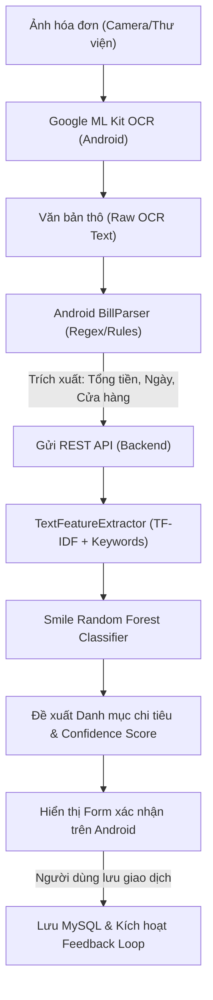
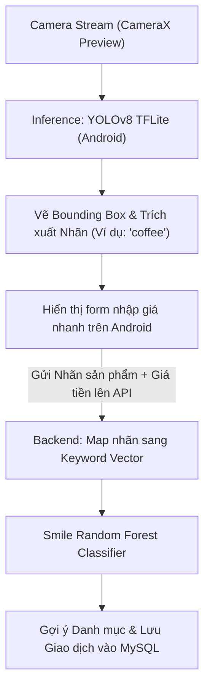

# AI Machine Learning Pipelines

Tài liệu này đặc tả chi tiết kiến trúc, quy trình xử lý dữ liệu và tích hợp các mô hình trí tuệ nhân tạo (AI/ML) trên toàn bộ hệ thống quản lý tài chính cá nhân.

---

## 1. Tổng quan Kiến trúc AI lai (Hybrid AI Architecture)

Hệ thống kết hợp sức mạnh của **Edge AI (AI chạy cục bộ trên Android)** và **Cloud AI (Phân tích thông minh trên Spring Boot Backend)**:
- **Android Client (Edge AI)**: Đảm nhận các tác vụ thị giác máy tính nặng nề (Nhận diện chữ viết OCR bằng Google ML Kit, nhận diện vật thể YOLOv8 bằng TensorFlow Lite) nhằm mang lại trải nghiệm thời gian thực, tiết kiệm băng thông và giảm chi phí máy chủ.
- **Spring Boot Backend (Cloud AI)**: Đảm nhận nhiệm vụ trích xuất đặc trưng văn bản, chạy mô hình phân loại **Random Forest** (sử dụng thư viện Java Smile) để gợi ý danh mục, và quản lý Feedback Loop nhằm nâng cao độ chính xác của mô hình theo thời gian.

---

## 2. Quy trình Quét hóa đơn (OCR Bill Scanner Pipeline)

Quy trình tự động hóa nhập liệu từ hóa đơn mua sắm giấy diễn ra qua 6 bước chính:

### Chi tiết các bước xử lý:
1. **Thu thập ảnh (Image Capture)**: Người dùng chụp ảnh hóa đơn qua camera hoặc chọn từ thư viện ảnh trên Android.
2. **Nhận dạng chữ viết cục bộ (Local Text Recognition)**:
   - Thư viện `play-services-mlkit-text-recognition` phân tích ảnh và trích xuất danh sách các dòng chữ (`Text Blocks`, `Lines`, `Elements`).
   - Trả về chuỗi văn bản thô đầy đủ (`rawOcrText`).
3. **Trích xuất thông tin cơ bản (Entity Extraction - Android)**:
   - Lớp `BillParser.java` sử dụng các biểu thức chính quy (Regex) tối ưu cho hóa đơn Việt Nam để lọc ra:
     - **Số tiền**: Tìm kiếm các từ khóa (`Tổng cộng`, `Thanh toán`, `Cần trả`, `Total`, `Cash`) đi kèm với chuỗi số có dấu chấm/phẩy phân cách (Ví dụ: `150.000`, `150,000`, `150000`).
     - **Ngày giao dịch**: Tìm kiếm định dạng ngày phổ biến (`DD/MM/YYYY`, `YYYY-MM-DD`).
     - **Tên cửa hàng (Merchant)**: Thường nằm ở 3 dòng đầu tiên của kết quả văn bản thô (Tên hóa đơn, tên thương hiệu như `Coopmart`, `Highlands Coffee`, `WinMart`).
4. **Trích xuất đặc trưng nâng cao (Feature Extraction - Backend)**:
   - Backend nhận chuỗi văn bản thô, chuyển đổi thành véc-tơ đặc trưng số thông qua bộ `TextFeatureExtractor`:
     - Áp dụng kỹ thuật TF-IDF (Term Frequency-Inverse Document Frequency) đơn giản hóa trên danh sách từ khóa tài chính tiếng Việt.
     - Đếm tần suất xuất hiện của các từ khóa danh mục (Ví dụ: từ "cà phê", "trà" chỉ thị danh mục `Ăn uống`; từ "xăng", "grab" chỉ thị danh mục `Di chuyển`).
     - Áp dụng khoảng số tiền (Amount Buckets) để làm đặc trưng bổ sung (Ví dụ: giao dịch dưới 30k thường là ăn uống/tiêu vặt, giao dịch trên 1 triệu thường là mua sắm lớn/hóa đơn dịch vụ).
5. **Dự báo bằng Random Forest (Smile Library)**:
   - Véc-tơ đặc trưng được nạp vào mô hình Random Forest Classifier.
   - Mô hình phân tích và trả về phân phối xác suất trên tất cả danh mục của người dùng.
   - Chọn ra danh mục có xác suất lớn nhất làm danh mục đề xuất, kèm theo độ tin cậy (`confidenceScore`).
6. **Xác nhận từ người dùng & Phản hồi (Feedback Loop)**:
   - Người dùng xem trước thông tin trên form Android. Họ có quyền sửa lại số tiền, ngày hoặc danh mục nếu AI nhận diện sai.
   - Khi giao dịch được xác nhận lưu, app gửi phản hồi về API `/api/ai-scan/feedback`. Nếu người dùng có chỉnh sửa, hệ thống sẽ ghi nhận cặp đặc trưng mới này vào cơ sở dữ liệu huấn luyện để tự động huấn luyện lại mô hình định kỳ.

---

## 3. Quy trình Quét sản phẩm (YOLO Product Scanner Pipeline)

Quy trình hỗ trợ nhập nhanh giao dịch khi người dùng mua lẻ một sản phẩm cụ thể (Ví dụ: 1 cốc cà phê, 1 chai nước ngọt, 1 hộp sữa).

### Chi tiết các bước xử lý:
1. **Truyền luồng Camera thời gian thực (CameraX Preview)**:
   - Thư viện Android Jetpack `CameraX` cung cấp luồng ảnh đầu vào liên tục tốc độ cao.
2. **Trí tuệ nhân tạo cục bộ (On-Device Object Detection)**:
   - Sử dụng tệp mô hình `yolo_product.tflite` đã được lượng tử hóa (Quantized) để tối ưu dung lượng và tốc độ xử lý trên CPU/GPU điện thoại di động.
   - Lớp `YoloDetector.java` thực hiện:
     - Co giãn ảnh đầu vào về kích thước chuẩn của mô hình (Ví dụ: 320x320 hoặc 640x640).
     - Thực thi suy luận (Inference) tìm kiếm các vật thể được định nghĩa trong `product_labels.txt`.
     - Áp dụng thuật toán Non-Maximum Suppression (NMS) để loại bỏ các bounding box trùng lặp.
3. **Vẽ khung nhận diện (Bounding Box Overlay)**:
   - Vẽ khung chữ nhật đè lên vị trí vật thể trên màn hình kèm nhãn nhãn nhận diện (Ví dụ: `Coffee: 89%`, `Bread: 91%`).
4. **Nhập giá nhanh**:
   - Khi người dùng bấm nút chụp khóa mục tiêu, hệ thống tự động điền nhãn vật thể làm tiêu đề giao dịch và mở biểu mẫu nhập giá tiền (nhập số tiền nhanh bằng bàn phím ảo).
5. **Gợi ý danh mục trên Backend**:
   - Gửi nhãn sản phẩm (Ví dụ: `coffee`) và số tiền lên backend.
   - Backend chuyển đổi nhãn sản phẩm thành từ khóa đặc trưng, chạy qua Random Forest để trả về danh mục tương ứng (Ví dụ: nhãn `coffee` -> danh mục `Ăn uống`).
   - Tạo giao dịch và lưu nhật ký quét sản phẩm vào bảng `ai_product_logs`.

---

## 4. Mô hình học máy Random Forest (Backend)

Hệ thống sử dụng thuật toán **Random Forest** của thư viện **Smile (Statistical Machine Intelligence and Learning Engine)** tại backend Spring Boot vì các lý do sau:
- **Độ tin cậy cao**: Random Forest là mô hình Ensemble Learning mạnh mẽ, hạn chế tối đa hiện tượng Overfitting so với Decision Tree đơn lẻ.
- **Tốc độ suy luận cực nhanh**: Phù hợp cho API phục vụ thời gian thực trên Java Virtual Machine (JVM).
- **Khả năng giải thích cao**: Dễ dàng trích xuất độ quan trọng của các đặc trưng (Feature Importance).

### Bộ đặc trưng huấn luyện (Feature Engineering):
1. **Tần suất từ khóa (Keyword Frequencies)**: Vector nhị phân chỉ thị sự xuất hiện của 100 từ khóa chi tiêu cốt lõi (Ví dụ: "coopmart", "highlands", "xang", "dien", "nuoc", "nha", "hoc", "cho", "quan").
2. **Đặc trưng Số tiền (Amount Value)**: Giá trị số tiền chi tiêu được chuẩn hóa.
3. **Đặc trưng Thời gian (Temporal Features)**: Ngày trong tuần (Thứ Hai - Chủ Nhật), Giờ trong ngày (Sáng, Trưa, Chiều, Tối).
