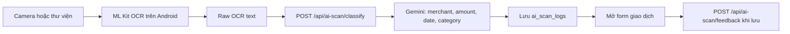
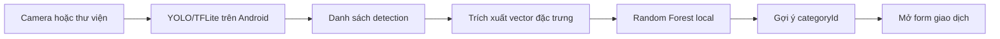

# AI Pipelines

## Tổng quan

Hệ thống dùng hai pipeline độc lập:

- OCR hóa đơn: ML Kit chạy trên Android, Gemini phân tích văn bản tại backend.
- Quét sản phẩm: YOLO/TFLite và Random Forest đều chạy local trên Android.

## OCR hóa đơn

Backend lưu log OCR để liên kết giao dịch và ghi nhận danh mục người dùng xác nhận. Bản demo không cung cấp endpoint quản trị để tái huấn luyện model.

## Quét sản phẩm

Pipeline sản phẩm không gọi backend AI và không lưu bảng log riêng. Model Random Forest được huấn luyện bằng các script trong `tools/`, sau đó export thành `ProductRandomForestModel.java` cho Android.
