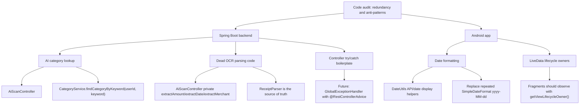

# Refactor Graph

This file tracks the cleanup targets from the code audit so future searches have one stable entry point.

## Status

- Backend AI category lookup: done
- Backend dead OCR parsing code: done
- Backend global exception handling: started; AI controllers use centralized handling
- Android LiveData lifecycle owner: checked; current Fragment usages already use `getViewLifecycleOwner()`
- Android date formatting: done; repeated `SimpleDateFormat` usage is centralized in `DateUtils`
