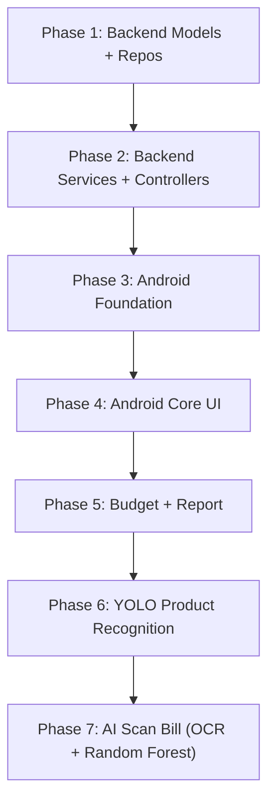

# Personal Finance App - Implementation Plan

Ứng dụng quản lý tài chính cá nhân sử dụng **Android Java + Firebase Auth + Spring Boot REST API (Java 21) + MySQL + YOLO Product Recognition + AI Scan Bill (Google ML Kit OCR) + Random Forest Classifier**.

## Các quyết định đã xác nhận

| # | Quyết định | Chi tiết |
|---|-----------|----------|
| 1 | **Authentication** | Firebase token verification only — không implement JWT riêng |
| 2 | **AI** | **YOLO**: nhận diện sản phẩm từ ảnh chụp (user nhập giá). **ML Kit OCR**: scan hóa đơn. **Random Forest** (ưu tiên) / Decision Tree (phương án phụ): phân loại chi tiêu. Không dùng Gemini API |
| 3 | **Ngôn ngữ UI** | **Tiếng Việt** |
| 4 | **Min SDK** | API 24 (Android 7.0) |
| 5 | **Java version** | Backend: **Java 21**. Android: Java 17 compatibility (theo Android Gradle Plugin) |

## Lưu ý trước khi triển khai

> [!WARNING]
> **Firebase Configuration**: Bạn cần cung cấp file `google-services.json` từ Firebase Console. Tôi sẽ tạo placeholder và hướng dẫn bạn thay thế.

> [!IMPORTANT]
> **MySQL**: Bạn cần có MySQL server chạy sẵn. Plan sẽ cấu hình Spring Boot kết nối tới `localhost:3306/personal_finance_app`.

---

## Proposed Changes

Triển khai theo **7 Phase** tuần tự, mỗi phase có thể build và test độc lập.

---

### Phase 1: Backend Spring Boot Foundation

Khởi tạo project Spring Boot (Java 21), cấu hình database, tạo entities và repositories cho tất cả các bảng.

> [!IMPORTANT]
> Bảng `ai_product_logs` sẽ được thêm vào file `database/schema.sql` trong phase này để đồng bộ schema trước khi code.

#### [NEW] `finance-backend/pom.xml`
- Spring Boot 3.x (Java 21), Spring Data JPA, MySQL Connector, Spring Web, Lombok
- Firebase Admin SDK (verify Firebase token server-side)
- Smile (Machine Learning library cho Random Forest classifier)

#### [NEW] `finance-backend/src/main/resources/application.properties`
- Cấu hình MySQL connection: `spring.datasource.url=jdbc:mysql://localhost:3306/personal_finance_app`
- JPA/Hibernate settings: `spring.jpa.hibernate.ddl-auto=validate`
- Server port: `8080`
- Firebase service account config path

#### [NEW] `finance-backend/src/main/java/com/example/financebackend/FinanceBackendApplication.java`
- Main Spring Boot application class

#### [NEW] Model classes (`finance-backend/src/main/java/com/example/financebackend/model/`)
| File | Mô tả | Mapping bảng |
|------|--------|-------------|
| `User.java` | Entity người dùng | `users` |
| `Account.java` | Ví/tài khoản tiền | `accounts` |
| `Category.java` | Danh mục thu chi | `categories` |
| `Transaction.java` | Giao dịch tài chính | `transactions` |
| `TransferGroup.java` | Nhóm chuyển tiền | `transfer_groups` |
| `Budget.java` | Ngân sách | `budgets` |
| `TransactionImage.java` | Ảnh hóa đơn | `transaction_images` |
| `AiScanLog.java` | Log OCR/AI | `ai_scan_logs` |
| `AiProductLog.java` | Log YOLO product detection | `ai_product_logs` |
| `Notification.java` | Thông báo | `notifications` |

#### [NEW] Repository interfaces (`finance-backend/src/main/java/com/example/financebackend/repository/`)
| File | Mô tả |
|------|--------|
| `UserRepository.java` | `findByFirebaseUid()`, `findByEmail()` |
| `AccountRepository.java` | `findByUserId()` |
| `CategoryRepository.java` | `findByUserIdOrIsDefaultTrue()` |
| `TransactionRepository.java` | `findByUserIdAndTransactionDateBetween()` |
| `TransferGroupRepository.java` | `findByUserId()` |
| `BudgetRepository.java` | `findByUserIdAndDateRange()` |
| `TransactionImageRepository.java` | `findByTransactionId()` |
| `AiScanLogRepository.java` | `findByUserId()` |
| `AiProductLogRepository.java` | `findByUserId()` |
| `NotificationRepository.java` | `findByUserIdAndIsReadFalse()` |

#### [NEW] DTO classes (`finance-backend/src/main/java/com/example/financebackend/dto/`)
- `UserDTO.java`, `TransactionDTO.java`, `AccountDTO.java`, `BudgetDTO.java`, `CategoryDTO.java`, `ReportDTO.java`
- Request/Response wrappers: `ApiResponse.java`, `LoginRequest.java`

---

### Phase 2: Backend Services & Controllers

Implement business logic và REST API endpoints.

#### [NEW] Service classes (`finance-backend/src/main/java/com/example/financebackend/service/`)
| File | Chức năng chính |
|------|----------------|
| `UserService.java` | Đồng bộ user từ Firebase, CRUD user |
| `AccountService.java` | Tạo/sửa/xóa ví, cập nhật số dư |
| `CategoryService.java` | CRUD danh mục, load danh mục mặc định |
| `TransactionService.java` | CRUD giao dịch, cập nhật balance ví, liên kết category |
| `TransferService.java` | Chuyển tiền giữa ví (tạo 2 transaction + transfer_group) |
| `BudgetService.java` | CRUD ngân sách, tính spent_amount, kiểm tra vượt ngân sách |
| `ReportService.java` | Thống kê theo ngày/tháng, tổng thu/chi, phân nhóm theo category |
| `NotificationService.java` | Tạo/đọc thông báo, đánh dấu đã đọc |
| `AiScanService.java` | Lưu log OCR, xử lý kết quả AI |
| `AiProductService.java` | Lưu log YOLO, nhận product name + price, gọi classifier |

#### [NEW] Controller classes (`finance-backend/src/main/java/com/example/financebackend/controller/`)
| File | Endpoints |
|------|-----------|
| `AuthController.java` | `POST /api/auth/firebase-login` |
| `UserController.java` | `GET/PUT /api/users/{id}` |
| `AccountController.java` | `GET/POST/PUT/DELETE /api/accounts` |
| `CategoryController.java` | `GET/POST/PUT/DELETE /api/categories` |
| `TransactionController.java` | `GET/POST/PUT/DELETE /api/transactions` |
| `TransferController.java` | `POST /api/transfers` |
| `BudgetController.java` | `GET/POST/PUT/DELETE /api/budgets` |
| `ReportController.java` | `GET /api/reports/daily`, `GET /api/reports/monthly`, `GET /api/reports/by-category` |
| `NotificationController.java` | `GET/PUT /api/notifications` |
| `AiScanController.java` | `POST /api/ai-scan/classify`, `POST /api/ai-scan/feedback` |
| `AiProductController.java` | `POST /api/ai-product/classify`, `POST /api/ai-product/log` |
| `AdminMlController.java` | `POST /api/admin/ml/retrain` (admin/dev only) |

#### [NEW] Config classes (`finance-backend/src/main/java/com/example/financebackend/config/`)
- `CorsConfig.java` - CORS cho Android app
- `FirebaseConfig.java` - Firebase Admin SDK init, verify Firebase ID token
- `FirebaseAuthFilter.java` - Servlet filter xác thực Firebase token trên mỗi request
- `SecurityConfig.java` - Cấu hình Spring Security sử dụng `FirebaseAuthFilter` (không dùng JWT)

---

### Phase 3: Android App Foundation

Khởi tạo Android project, setup Firebase Auth, Retrofit, và navigation.

#### [NEW] `PersonalFinanceApp/app/build.gradle`
Dependencies:
- `firebase-auth`, `play-services-auth` (Google Sign-In)
- `retrofit2`, `converter-gson`
- `recyclerview`, `material`, `constraintlayout`
- `ml-kit-text-recognition` (OCR)
- `tensorflow-lite` + `tensorflow-lite-support` (YOLO inference)
- `mpandroidchart` (biểu đồ)
- `camerax` (camera preview cho scan)
- Min SDK: **API 24**, Target SDK: API 34
- Java 17 compatibility (theo Android Gradle Plugin, toolchain tương thích)

#### [NEW] `PersonalFinanceApp/app/src/main/AndroidManifest.xml`
- Permissions: `INTERNET`, `CAMERA`, `READ_MEDIA_IMAGES` (Android 13+), Photo Picker (cho gallery)
- Activities: `SplashActivity` (launcher), `LoginActivity`, `RegisterActivity`, `MainActivity`, `ScanBillActivity`, `ScanProductActivity`

#### [NEW] Activities (`activities/`)
| File | Chức năng |
|------|-----------|
| `SplashActivity.java` | Check login state → redirect LoginActivity hoặc MainActivity |
| `LoginActivity.java` | Firebase Email/Password + Google Sign-In |
| `RegisterActivity.java` | Đăng ký tài khoản mới qua Firebase |
| `MainActivity.java` | Host BottomNavigationView + Fragments |
| `ScanBillActivity.java` | Camera capture + OCR hóa đơn |
| `ScanProductActivity.java` | Camera capture + YOLO nhận diện sản phẩm |

#### [NEW] API layer (`api/`)
| File | Mô tả |
|------|--------|
| `RetrofitClient.java` | Singleton Retrofit instance, base URL config |
| `ApiService.java` | Interface định nghĩa tất cả API endpoints |
| `TokenInterceptor.java` | OkHttp interceptor gắn Firebase token vào header |

#### [NEW] Firebase layer (`firebase/`)
| File | Mô tả |
|------|--------|
| `FirebaseAuthHelper.java` | Login, register, Google Sign-In, get token |
| `FirebaseAuthCallback.java` | Interface callback cho auth events |

#### [NEW] Models (`models/`)
- Mirror các DTO từ backend: `User.java`, `Account.java`, `Category.java`, `Transaction.java`, `Budget.java`, `Notification.java`, `AiScanLog.java`, `AiProductLog.java`
- AI result models: `ProductDetectionResult.java`, `CategoryPrediction.java`
- `ApiResponse.java` - Generic response wrapper

---

### Phase 4: Android Core Features (Fragments + UI)

Implement các fragment chính và UI cho chức năng CRUD.

#### [NEW] Fragments (`fragments/`)
| File | Chức năng |
|------|-----------|
| `HomeFragment.java` | Dashboard: tổng thu/chi tháng, giao dịch gần đây, biểu đồ nhỏ |
| `TransactionFragment.java` | Danh sách giao dịch, filter theo ngày/tháng, search |
| `AddTransactionFragment.java` | Form thêm/sửa giao dịch (DialogFragment hoặc BottomSheet) |
| `BudgetFragment.java` | Danh sách ngân sách, progress bar, thêm ngân sách mới |
| `ReportFragment.java` | Biểu đồ tròn (chi theo danh mục), biểu đồ cột (thu/chi theo tháng) |
| `ProfileFragment.java` | Thông tin user, quản lý ví, cài đặt, đăng xuất |

#### [NEW] Adapters (`adapters/`)
| File | Mô tả |
|------|--------|
| `TransactionAdapter.java` | RecyclerView adapter cho danh sách giao dịch |
| `CategoryAdapter.java` | Adapter cho grid/list danh mục |
| `AccountAdapter.java` | Adapter cho danh sách ví |
| `BudgetAdapter.java` | Adapter cho danh sách ngân sách |
| `NotificationAdapter.java` | Adapter cho danh sách thông báo |

#### [NEW] Layout XML files (`res/layout/`)
| File | Mô tả |
|------|--------|
| `activity_splash.xml` | Splash screen với logo |
| `activity_login.xml` | Form đăng nhập + nút Google |
| `activity_register.xml` | Form đăng ký |
| `activity_main.xml` | BottomNavigationView + FrameLayout container |
| `activity_scan_bill.xml` | Camera preview + OCR result overlay |
| `activity_scan_product.xml` | Camera preview + YOLO bounding box overlay + form nhập giá |
| `fragment_home.xml` | Dashboard layout |
| `fragment_transaction.xml` | RecyclerView + FAB + filter bar |
| `fragment_add_transaction.xml` | Form input giao dịch |
| `fragment_budget.xml` | RecyclerView ngân sách |
| `fragment_report.xml` | Charts container |
| `fragment_profile.xml` | User info + settings |
| `item_transaction.xml` | Row item giao dịch |
| `item_category.xml` | Grid item danh mục |
| `item_account.xml` | Row item ví |
| `item_budget.xml` | Row item ngân sách + progress |

#### [NEW] Resources
- `res/values/colors.xml` - Bảng màu chủ đạo (xanh dương/xanh lá tài chính)
- `res/values/strings.xml` - Tất cả text strings (hỗ trợ i18n)
- `res/values/styles.xml` - Theme Material Design 3
- `res/drawable/` - Icons, backgrounds, shapes
- `res/menu/bottom_nav_menu.xml` - Menu cho BottomNavigationView

---

### Phase 5: Budget, Report & Notifications

#### [MODIFY] `BudgetFragment.java`
- Hiển thị progress bar (spent/limit)
- Cảnh báo khi vượt 80% và 100% ngân sách

#### [MODIFY] `ReportFragment.java`
- Tích hợp MPAndroidChart
- Biểu đồ tròn: phân bổ chi tiêu theo danh mục
- Biểu đồ cột: thu/chi theo ngày trong tháng
- Filter theo khoảng thời gian

#### [NEW] Utils (`utils/`)
| File | Mô tả |
|------|--------|
| `CurrencyFormatter.java` | Format số tiền VND: `1,234,567 ₫` |
| `DateUtils.java` | Parse/format ngày, tính khoảng thời gian |
| `SharedPrefManager.java` | Lưu token, user info local |
| `Constants.java` | Base URL, keys, config |

---

### Phase 6: YOLO Product Recognition

Tính năng **chụp ảnh sản phẩm → YOLO nhận diện → gợi ý tên/loại → user nhập giá → phân loại danh mục → lưu giao dịch**.

#### Pipeline:
```
Camera chụp sản phẩm
→ YOLO nhận diện sản phẩm (on-device, TFLite)
→ App gợi ý tên sản phẩm / loại sản phẩm
→ Người dùng nhập giá
→ Random Forest phân loại danh mục chi tiêu (server-side)
→ Lưu thành giao dịch
```

#### 6A. Android - YOLO On-Device

#### [MODIFY] `ScanProductActivity.java`
- CameraX preview realtime
- Load YOLO TFLite model, chạy inference trên device
- Vẽ bounding box + label lên camera preview
- Hiển thị tên sản phẩm được nhận diện
- Form nhập giá → gửi lên backend phân loại + lưu giao dịch

#### [NEW] AI module Android - YOLO (`ai/`)
| File | Mô tả |
|------|--------|
| `YoloDetector.java` | Load TFLite model, preprocess ảnh, chạy inference, post-process (NMS) |
| `ProductDetectionResult.java` | Model: detected label, confidence, bounding box |
| `BoundingBoxOverlay.java` | Custom View vẽ bounding box lên camera preview |

#### [NEW] `PersonalFinanceApp/app/src/main/assets/`
- `yolo_product.tflite` - YOLO model đã convert sang TFLite
- `product_labels.txt` - Danh sách labels sản phẩm (cà phê, bánh mì, xăng, quần áo...)

> [!CAUTION]
> **YOLO Model (dependency bắt buộc)**: Cần chuẩn bị trước 1 file YOLO model đã train và convert sang TFLite format. Nếu chưa có model, Phase 6 chỉ code được phần camera preview + inference placeholder. Bạn cần cung cấp file `yolo_product.tflite` và `product_labels.txt` để chạy nhận diện thực tế.

#### 6B. Database

#### [NEW] Bảng `ai_product_logs` (thêm vào `schema.sql`)
```sql
CREATE TABLE IF NOT EXISTS ai_product_logs (
    ai_product_log_id INT AUTO_INCREMENT PRIMARY KEY,
    user_id INT NOT NULL,
    transaction_id INT NULL,
    detected_product VARCHAR(150),
    confidence_score DECIMAL(5,4),
    user_entered_price DECIMAL(15,2),
    suggested_category_id INT NULL,
    created_at DATETIME DEFAULT CURRENT_TIMESTAMP,
    FOREIGN KEY (user_id) REFERENCES users(user_id) ON DELETE CASCADE,
    FOREIGN KEY (transaction_id) REFERENCES transactions(transaction_id) ON DELETE SET NULL,
    FOREIGN KEY (suggested_category_id) REFERENCES categories(category_id) ON DELETE SET NULL
);
```

---

### Phase 7: AI Scan Bill (OCR + Random Forest)

Tính năng **chụp hóa đơn → OCR đọc chữ → trích xuất dữ liệu → phân loại chi tiêu → lưu giao dịch**.

#### Pipeline:
```
Camera chụp hóa đơn
→ ML Kit OCR đọc chữ (on-device)
→ BillParser lấy tổng tiền, ngày, cửa hàng
→ Random Forest phân loại chi tiêu (server-side)
→ Lưu thành giao dịch
```

#### 7A. Android - OCR Processing

#### [MODIFY] `ScanBillActivity.java`
- Camera capture hoặc chọn ảnh từ gallery
- Google ML Kit Text Recognition xử lý ảnh on-device
- Parse kết quả OCR: tìm tổng tiền, ngày, tên cửa hàng
- Gửi raw OCR text + extracted data lên backend để phân loại

#### [NEW] AI module Android - OCR (`ai/`)
| File | Mô tả |
|------|--------|
| `OcrProcessor.java` | Gọi ML Kit OCR, trả về raw text |
| `BillParser.java` | Regex/rule-based parse: tổng tiền, ngày, merchant |
| `ScanResult.java` | Model chứa kết quả scan (amount, date, merchant, rawText) |

#### 7B. Backend - Random Forest Classifier (dùng chung cho cả YOLO và OCR)

#### [NEW] AI module Backend (`finance-backend/.../ai/`)
| File | Mô tả |
|------|--------|
| `ExpenseClassifierService.java` | Load trained Random Forest model, predict category từ input (OCR text hoặc product name) |
| `TextFeatureExtractor.java` | Trích xuất features: TF-IDF, keyword presence, amount range, merchant patterns |
| `ModelTrainer.java` | Huấn luyện Random Forest model từ labeled data (chạy offline hoặc scheduled) |
| `TrainingDataService.java` | Quản lý training data từ confirmed transactions của user |
| `CategoryPrediction.java` | DTO chứa predicted category + confidence score |

#### [NEW] `finance-backend/src/main/resources/ml/`
- `initial_training_data.csv` - Dữ liệu huấn luyện ban đầu (keyword → category mapping)
- `random_forest_model.ser` - Serialized trained model (tự động tạo khi train)

#### [MODIFY] AI Controllers (đã tạo skeleton ở Phase 2, Phase 7 hoàn thiện logic AI)
| File | Endpoints |
|------|----------|
| `AiScanController.java` | `POST /api/ai-scan/classify` - Nhận OCR text, trả về predicted category |
| | `POST /api/ai-scan/feedback` - User confirm/correct → thêm vào training data |
| `AiProductController.java` | `POST /api/ai-product/classify` - Nhận product name, trả về predicted category |
| | `POST /api/ai-product/log` - Lưu log product detection |
| `AdminMlController.java` | `POST /api/admin/ml/retrain` - Trigger retrain model (admin/dev only, có auth check) |

#### Random Forest Classification Pipeline (dùng chung):
```
Input (OCR text HOẶC product name + price)
→ Backend: TextFeatureExtractor → extract features
→ Backend: Random Forest model → predict category + confidence
→ Response → Android hiển thị suggested category
→ User confirm/correct → feedback → update training data
```

#### Feature Extraction Strategy:
- **Keyword features**: Đếm từ khóa liên quan mỗi category ("cà phê", "grab", "điện", "siêu thị"...)
- **Product name features**: Map tên sản phẩm YOLO → category keywords
- **Amount range**: Nhóm số tiền thành buckets (< 50k, 50-200k, 200k-1M, > 1M)
- **Merchant patterns**: Regex match tên cửa hàng phổ biến
- **Time features**: Giờ trong ngày, ngày trong tuần

#### Training Flow:
```
User confirmed transactions (MySQL)
→ TrainingDataService → extract features
→ ModelTrainer → Random Forest (Smile library)
→ Serialize model → random_forest_model.ser
```

> [!TIP]
> Random Forest classifier dùng chung cho cả 2 pipeline (YOLO product + OCR bill). Model tự cải thiện khi user xác nhận/sửa category prediction.

---

## Tổng quan File Count

| Component | Số file ước tính |
|-----------|-----------------|
| Backend Models | 10 |
| Backend Repositories | 11 |
| Backend DTOs | 8 |
| Backend Services | 10 |
| Backend Controllers | 11 |
| Backend Config | 4 |
| Backend AI/ML Module | 5 |
| ML Resources | 2 |
| Android Activities | 6 |
| Android Fragments | 6 |
| Android Adapters | 5 |
| Android API/Firebase | 5 |
| Android AI - YOLO | 3 |
| Android AI - OCR | 3 |
| Android YOLO Assets | 2 |
| Android Utils | 4 |
| Android Models | 11 |
| Layout XMLs | ~17 |
| Resource files | ~5 |
| **Tổng** | **~128 files** |

---

## Verification Plan

### Automated Tests
1. **Backend**:
   - Chạy `mvn spring-boot:run` - verify server khởi động thành công
   - Test API bằng curl/Postman cho từng endpoint
   - Kiểm tra kết nối MySQL và schema mapping

2. **Android**:
   - Build APK: `./gradlew assembleDebug` - verify không có compile error
   - Chạy trên emulator và kiểm tra từng màn hình

### Manual Verification
- Test flow đăng nhập Firebase (Email + Google)
- Test CRUD giao dịch end-to-end (Android → API → MySQL → Response)
- Test chuyển tiền giữa ví
- Test tạo ngân sách và kiểm tra cảnh báo vượt ngân sách
- Test YOLO product detection với ảnh sản phẩm thực tế
- Test AI Scan Bill với ảnh hóa đơn thực tế
- Test Random Forest classification accuracy
- Test biểu đồ báo cáo với dữ liệu mẫu

---

## Thứ tự triển khai đề xuất



> [!TIP]
> - Phase 6 (YOLO) và Phase 7 (OCR) có thể làm **song song** vì chúng độc lập nhau, chỉ chia sẻ Random Forest classifier backend.
> - Có thể làm song song Phase 1-2 (Backend) và Phase 3 (Android Foundation) nếu có 2 người.
