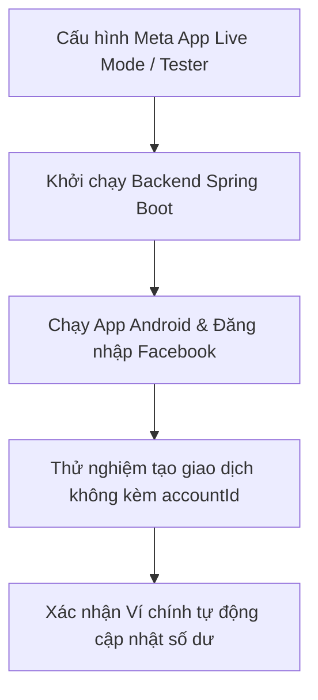

# Active Context: Current Status & Focus

Tài liệu này ghi nhận trạng thái hiện tại của dự án Personal Finance App, tiêu điểm công việc đang triển khai và các bước hành động tiếp theo.

---

## 🔍 Trạng thái Hiện tại (Current Status)

Chúng ta đã hoàn thành xuất sắc các cột mốc quan trọng trong dự án:
*   **Android MVVM Refactoring (ĐÃ HOÀN THÀNH)**: Chuyển đổi toàn bộ logic Retrofit và UI sang kiến trúc MVVM sạch, sử dụng `LiveData`, `Repositories` và `ViewModels`.
*   **Thiết lập Agent Memory (ĐÃ HOÀN THÀNH)**: Thiết lập toàn bộ hệ thống tệp ngữ cảnh trong `memory-bank/` và các quy tắc AI agent (`.clinerules`, `.cursorrules`).
*   **Nâng cấp Giao diện CapMoney Obsidian-Dark (ĐÃ HOÀN THÀNH)**:
    *   Thiết kế lại 5 Fragment chính khớp nối 100% với phong cách obsidian-dark cao cấp của CapMoney (Trang chủ lưới Lịch tháng, Thống kê Doughnut Chart & Progress bars, Tài khoản & quản lý danh sách ví, Ngân sách empty state, Cá nhân grid 2x2 & premium card).
    *   **Build Verification**: Biên dịch Gradle thành công 100% (`BUILD SUCCESSFUL` với 39 actionable tasks) sau khi khắc phục lỗi import thư viện đồ thị `MPAndroidChart`.

---

## 🎯 Tiêu điểm Công việc (Current Focus)

1.  **Cấu hình Meta Developer Console cho Facebook Login**: Hỗ trợ người dùng giải quyết lỗi "Ứng dụng không hoạt động" (App Not Active) bằng cách chuyển đổi cấu hình App Mode sang Live hoặc phân quyền vai trò Tester.
2.  **Xác thực End-to-End**: Chạy thử nghiệm thực tế luồng đăng nhập (Email, Google, Facebook) và xác nhận đồng bộ hóa ví mặc định ("Ví chính") hoạt động chính xác trên cả Client lẫn Backend.

---

## 🚀 Các Bước tiếp theo (Next Steps)

### 1. Giải quyết triệt để lỗi App Not Active trên Facebook
*   Hướng dẫn chi tiết các bước trên Meta Developer Console để người dùng kích hoạt trạng thái **Live (Đang hoạt động)** hoặc cấu hình **Tester Role** cho tài khoản kiểm thử.

### 2. Tiến hành chạy thủ công E2E kiểm chứng hệ thống
*   Khởi chạy server Spring Boot backend qua lệnh `mvn spring-boot:run` và đảm bảo kết nối cơ sở dữ liệu MySQL ổn định.
*   Kiểm tra logic tạo giao dịch:
    -   Tạo giao dịch thu/chi mới trên app Android (không có Spinner chọn ví).
    -   Kiểm tra database MySQL bảng `transactions` xem `account_id` có tự động được gán vào ID của **"Ví chính"** hay không.
    -   Kiểm tra số dư cột `balance` của ví trong bảng `accounts` xem có thay đổi chính xác không.
