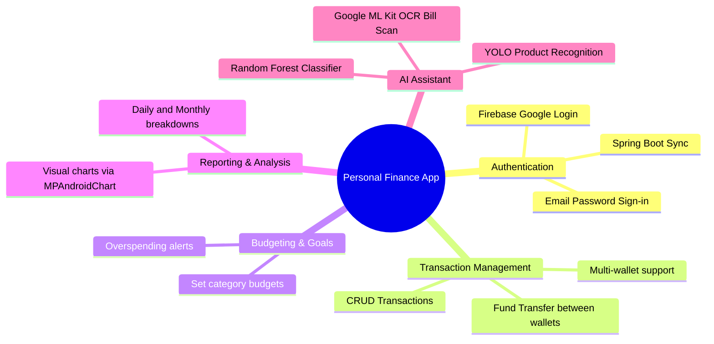

# Product Context: Personal Finance App

Ứng dụng Quản lý Tài chính Cá nhân là một giải pháp toàn diện giúp người dùng theo dõi thu chi, lập kế hoạch ngân sách và phân tích sức khỏe tài chính thông qua việc kết hợp công nghệ di động hiện đại và trí tuệ nhân tạo (AI/ML).

## 🚀 Tầm nhìn Sản phẩm (Why this app exists?)

Trong thế giới hiện đại, việc quản lý tài chính cá nhân ngày càng trở nên phức tạp do có nhiều nguồn thu nhập, nhiều tài khoản ngân hàng/ví điện tử và nhu cầu chi tiêu đa dạng. Người dùng thường gặp khó khăn trong việc:
*   Ghi chép giao dịch thủ công mất thời gian và dễ quên.
*   Không kiểm soát được ngân sách dẫn đến chi tiêu vượt kế hoạch.
*   Thiếu các báo cáo trực quan để nhận biết xu hướng tiêu dùng.
*   Khó khăn trong việc phân loại các khoản chi tiêu một cách hợp lý.

**Personal Finance App** sinh ra để giải quyết những nỗi đau trên bằng cách tự động hóa quy trình nhập liệu và phân loại chi tiêu nhờ AI tích hợp, cung cấp trải nghiệm mượt mà, trực quan và an toàn.

---

## 👥 Đối tượng Người dùng Mục tiêu (Target Audience)

1.  **Học sinh, Sinh viên**: Cần quản lý chi tiêu sinh hoạt phí hạn hẹp, học cách thiết lập ngân sách tiết kiệm đầu đời.
2.  **Người đi làm (Office Workers)**: Cần quản lý nhiều tài khoản ngân hàng, ví điện tử, theo dõi lương và các khoản chi tiêu gia đình.
3.  **Người kinh doanh tự do (Freelancers)**: Cần phân biệt rõ dòng tiền cá nhân và dòng tiền công việc, theo dõi báo cáo thu chi hàng tháng.

---

## ⚡ Các Tính năng Cốt lõi (Core Features)

### 1. Quản lý Tài khoản & Ví (Account/Wallet Management)
- Hỗ trợ người dùng tạo nhiều tài khoản/ví khác nhau (Ví tiền mặt, Ví ngân hàng, Ví Momo...).
- Thực hiện chuyển tiền giữa các ví với nhau (Fund Transfer) một cách minh bạch, tự động cập nhật số dư ròng.

### 2. Quản lý Giao dịch & Phân loại (Transaction Management)
- Ghi chép các khoản thu (Income) và chi (Expense).
- Phân nhóm giao dịch theo danh mục (Ăn uống, Mua sắm, Di chuyển, Hóa đơn...) để dễ dàng theo dõi.

### 3. Thiết lập Ngân sách (Budgeting)
- Cho phép đặt hạn mức chi tiêu cho từng danh mục trong một khoảng thời gian (tuần/tháng).
- Tự động theo dõi tiến độ chi tiêu và đưa ra cảnh báo trực quan (ví dụ: khi chi tiêu vượt quá 80% hoặc 100% hạn mức).

### 4. Báo cáo & Thống kê Trực quan (Reporting)
- Biểu đồ tròn biểu diễn tỷ lệ phân bổ chi tiêu giữa các danh mục.
- Biểu đồ cột biểu diễn xu hướng thu nhập và chi tiêu qua các tháng.
- Dữ liệu trực quan hóa giúp người dùng có cái nhìn tổng quan và đưa ra quyết định tài chính sáng suốt hơn.

### 5. Quét hóa đơn & Nhận diện sản phẩm bằng AI (AI-Powered Assistant)
- **AI Scan Bill (Google ML Kit OCR)**: Chụp ảnh hóa đơn mua sắm, tự động đọc văn bản và trích xuất các thông tin chính như tổng tiền, ngày mua, tên cửa hàng.
- **YOLO Product Recognition (On-device TFLite)**: Chụp ảnh một sản phẩm cụ thể (ví dụ: cốc cà phê, ổ bánh mì), tự động nhận dạng sản phẩm đó để đưa vào giao dịch nhanh.
- **Random Forest Classifier (Smile Library Backend)**: Tự động dự đoán danh mục chi tiêu phù hợp dựa trên thông tin hóa đơn hoặc tên sản phẩm được quét, sau đó cải thiện độ chính xác thông qua phản hồi (feedback loop) của người dùng.
